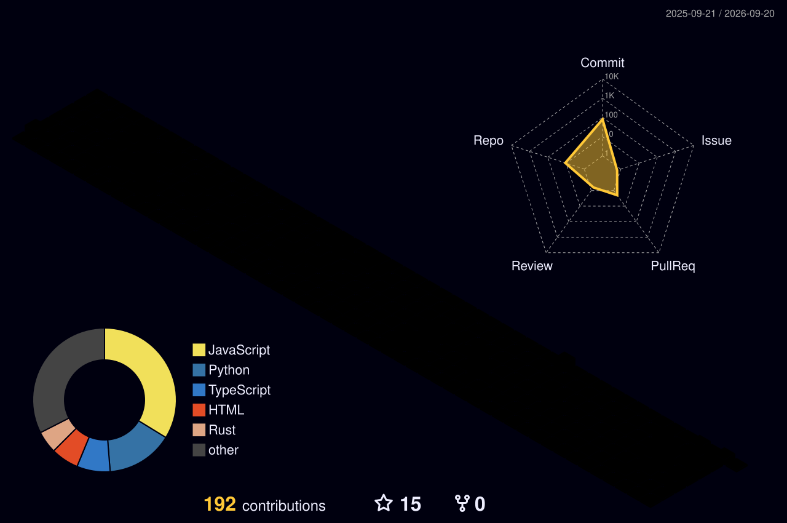
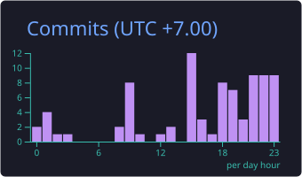
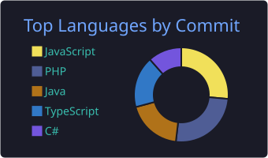
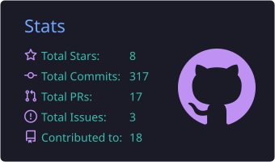
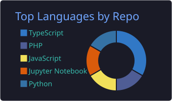

<!-- ═══════════════════════════════════════════════════════════════════ -->
<!--                    G I T H U B   P R O F I L E                    -->
<!--              ✦  y o s e d i e  /  y o s e d i e  ✦               -->
<!-- ═══════════════════════════════════════════════════════════════════ -->

<div align="center">

<!-- Animated Header Banner -->


<!-- Typing SVG -->
<a href="https://git.io/typing-svg">
  
</a>

<br/>

<!-- Quick Badges -->
<a href="https://www.linkedin.com/in/yosedie"></a>
<a href="mailto:ryosedie@gmail.com"></a>
<a href="https://yosedie.github.io"></a>
<a href="https://github.com/yosedie?tab=repositories"></a>

<br/><br/>

<!-- Profile Views & Followers -->


</div>

<br/>

<!-- ═══════════════════ ABOUT ME ═══════════════════ -->


##  &nbsp;About Me

```yaml
name: ヨセディ
location: 🇮🇩
current_roles:
  - 🤖 AI Engineer @ FEHA (Amsterdam, Remote)
  - 🧠 ML Engineer @ NGOPER (Indonesia, Remote)
education:
  pursuing: M.S. Information Technology — iSTTS (2026-2028)
  completed: B.S. Computer Science — iSTTS (2022-2025)
focus_areas:
  - Advanced Intelligent Systems
  - Computer Vision & Deep Learning
  - Generative AI & LLMs
  - Cybersecurity & Secure AI Systems
daily_fuel: Gaming → 💡 Ideas → ⌨️ Code → 🚀 Deploy → 🔁 Repeat
ask_me_about: Python, Computer Vision, LLMs, GCP, Cybersecurity
motto: "Leveraging the art of prompt engineering to secure AI models, ensuring safety through semantic precision rather than complex code"
```

<br/>

<!-- ═══════════════════ SKYLINE ═══════════════════ -->

## 🏙️ &nbsp;Contribution Skyline

<div align="center">



<br/>

<sub>🏭 my year in code, rendered as a city — regenerated weekly by GitHub Actions</sub>

</div>

<br/>

<!-- ═══════════════════ TECH STACK ═══════════════════ -->

## 🛠️ &nbsp;Tech Arsenal

<div align="center">

<!-- Languages -->
<h4>💻 Languages</h4>
<p>
  
</p>

<!-- Frameworks & Libraries -->
<h4>🧰 Frameworks & Libraries</h4>
<p>
  
</p>

<!-- Cloud, DevOps & Data -->
<h4>☁️ Cloud & DevOps</h4>
<p>
  
</p>

<!-- Databases -->
<h4>🗄️ Databases</h4>
<p>
  
</p>

<!-- AI/ML Tools -->
<h4>🧠 AI / ML</h4>
<p>
  
  
  
  
</p>

</div>

<br/>


<!-- ═══════════════════ CODE RHYTHM ═══════════════════ -->

## ⏰ &nbsp;Code Rhythm

<div align="center">




<br/>

<sub>when & what I actually commit — synced weekly</sub>

</div>

<br/>

<!-- ═══════════════════ CERTIFICATIONS HIGHLIGHT ═══════════════════ -->

## 🏅 &nbsp;Certifications Highlight

<div align="center">

<table>
<tr>
  <td align="center" width="25%">
    <br/>
    <sub><b>15+ Badges</b></sub><br/>
    <sub>Gemini • ML Engineer • Cybersecurity • Cloud Architect</sub>
  </td>
  <td align="center" width="25%">
    <br/>
    <sub><b>10+ Courses</b></sub><br/>
    <sub>Deep Learning • NLP • Jetson Nano • OpenUSD</sub>
  </td>
  <td align="center" width="25%">
    <br/>
    <sub><b>20+ Badges</b></sub><br/>
    <sub>Python • JS • Cybersecurity • Networking • Data Science</sub>
  </td>
  <td align="center" width="25%">
    <br/>
    <sub><b>System Admin</b></sub><br/>
    <sub>RH124 (RHEL 9.3) via Texas A&M</sub>
  </td>
</tr>
</table>

</div>

<br/>


<!-- ═══════════════════ GITHUB STATS ═══════════════════ -->

## 📊 &nbsp;GitHub Analytics

<div align="center">

<!-- Row 1: Stats + Languages (generated weekly by GitHub Actions) -->
<a href="https://github.com/yosedie">
  
  
</a>

<br/><br/>

<!-- Row 2: Streak -->
<a href="https://github.com/yosedie">
  
</a>

</div>

<br/>

<!-- ═══════════════════ SNAKE ═══════════════════ -->

<div align="center">

<picture>
  <source media="(prefers-color-scheme: dark)" srcset="https://raw.githubusercontent.com/yosedie/yosedie/output/github-contribution-grid-snake-dark.svg" />
  <source media="(prefers-color-scheme: light)" srcset="https://raw.githubusercontent.com/yosedie/yosedie/output/github-contribution-grid-snake.svg" />
  
</picture>

</div>

<br/>

<!-- ═══════════════════ TROPHIES ═══════════════════ -->

<div align="center">

<!-- Trophies -->
<a href="https://github.com/yosedie">
  
</a>

</div>

<br/>

<!-- ═══════════════════ CONNECT ═══════════════════ -->

<div align="center">

<h2>🤝 Let's Connect & Build Something Amazing</h2>

<a href="https://www.linkedin.com/in/yosedie"></a>&nbsp;
<a href="mailto:ryosedie@gmail.com"></a>&nbsp;
<a href="https://yosedie.github.io"></a>&nbsp;
<a href="https://www.cloudskillsboost.google/public_profiles/7e433ba7-5348-4f9d-807c-538c9d9e8b63"></a>

<br/><br/>


</div>

<!-- Footer Wave -->

